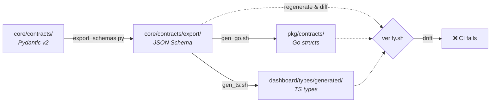
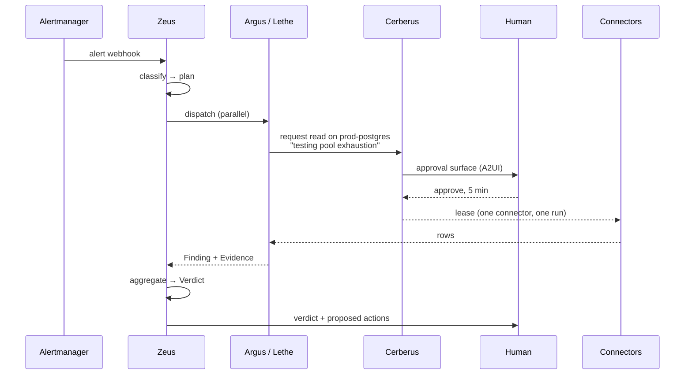

# Pantheon Architecture

> **Phase 0.** This describes the system as designed and as the contracts and
> structure encode it. Behaviour arrives in Phases 1–5 — see
> [ROADMAP.md](ROADMAP.md). Where something does not exist yet, this document
> says so.

## The shape of the thing

Pantheon receives a **trigger**, decides which specialists to consult, runs them
in parallel, and returns one ranked **verdict** with proposed actions. Every
write passes a guardrail chain; every credential is brokered; every decision is
recorded on the run.

Six layers, each with one job:

| Layer | Owns | Never does |
|---|---|---|
| **Interface** `dashboard/`, `api/agui/` | Streaming a run to a human, collecting decisions | Business logic |
| **Orchestration** `core/orchestrator/`, `core/guardrails/` | Routing, planning, dispatch, aggregation, approvals | Talk to infrastructure |
| **Agents** `agents/` | Domain reasoning, producing Findings | Name a model; hold a credential; orchestrate each other |
| **Infrastructure** `core/llm/`, `core/cerberus/` | Resolving models, brokering credentials | Appear in the agent roster |
| **Connectors** `connectors/` | Talking to real systems over MCP | Contain reasoning |
| **Contracts** `core/contracts/` | Every cross-language shape | Depend on anything above |

Dependencies point **downward only**. An agent depends on contracts; contracts
depend on nothing.

## Contracts are the source of truth



One artifact feeds both generators, so there is **one drift surface**. Two
pipelines could diverge while each looked green
([ADR 0002](docs/adr/0002-codegen-from-json-schema.md)).

`verify.sh` regenerates into a temp directory and diffs against the committed
output. It has been verified by planting deliberate drift and confirming it
exits non-zero — which is how a real bug in it was found: it raised an exception
instead of reporting drift, so it had never actually worked.

**Hand-writing a mirrored type in Go or TypeScript is forbidden.** Add it to
`core/contracts/` and run `make codegen`.

## The three flows

### 1. Incident — reactive

An alert fires. Something is broken now.



The agent receives **rows**, never the password. A fully prompt-injected agent
cannot leak what it never held
([ADR 0005](docs/adr/0005-credential-brokering.md)).

Phase 1 delivers Argus and the Prometheus/Alertmanager connectors; Phase 2 makes
Zeus real; Phase 3 makes the approval path real.

### 2. Delivery — continuous

A pipeline fails, or a merge lands. Is delivery healthy?

Hephaestus separates flake from real regression; Themis computes DORA metrics
and judges the trend. Both read GitLab/GitHub connectors. This flow rarely
writes, so it mostly needs read grants — and read is a **separate grant** from
write, always.

Phase 4.

### 3. Proactive — scheduled

Nothing is broken. What will break?

Moira forecasts saturation; Mnemosyne surfaces prior incidents matching current
conditions; Eris proposes chaos experiments to test resilience; Clio writes it
up. Driven by Temporal schedules rather than an inbound trigger.

Phase 5.

## Delphi — agents never name a model

`core/llm/` is the LLM gateway. An agent declares what it *needs*:

```python
ModelRequirements(
    capabilities={Capability.TOOL_USE, Capability.JSON_MODE},
    min_context=32_000,
    tier=Tier.BALANCED,
    max_cost_per_call=0.02,
)
```

Delphi resolves that to a concrete model: **per-task override → per-agent
binding → tier default → global default**. On failure: **fallback chain →
budget guard → hard stop**, never a silent downgrade — an agent that asked for
tool use and silently got a model without it does not fail, it produces
confident nonsense.

Capabilities are **probed**, not tabulated. Four probes (trivial completion,
tool call, JSON-schema response, tiny image) measure what a model actually does
behind a particular gateway. A static table would be stale within weeks and
would exclude every model released after it was written.

Every resolution writes a `ResolutionRecord` onto the Investigation, so a run
explains its own cost. ([ADR 0004](docs/adr/0004-llm-provider-abstraction.md))

## Cerberus — agents never hold credentials

`core/cerberus/`, three heads: **store** (custody), **policy** (decisions),
**audit** (memory).

The threat model is not carelessness. It is:

> Assume the agent is fully prompt-injected and hostile.

A secret in an agent's context becomes part of a prompt, which is sent to a
model provider and logged — by us, by them, and by anything between. That is
unauditable and unrevocable, and it happens on the *success* path.

So credentials are brokered: request a capability → policy → Approval Gate if
there is no grant → a lease bound to one connector and one investigation → the
connector redeems it → the agent gets results.

Production targets and **all** writes default to ask-each-time. Break-glass
revokes everything and kills live leases immediately, because revocation that
does not kill leases is advisory until the longest TTL expires.

Three independent guards hold the invariant: a schema scan across JSON Schema,
Go **and** TypeScript; an import-graph boundary preventing agents importing the
modules that hold plaintext; and a redactor tested by planting a secret and
asserting it survives no log, trace or prompt. The first two catch *names*; the
third catches *values*. Neither is redundant.

## The user boundary — AG-UI and A2UI

**AG-UI is the transport. A2UI is the payload.** That division is the thing
people get wrong.

Most of what Pantheon emits is ordinary AG-UI: `RunStarted`, `StepStarted`,
`ToolCallStart`, `StateDelta`. A2UI appears only when an agent needs a human to
*see* or *decide* something — an approval, a credential request.

**The shared state object is the `Investigation`**: `StateSnapshot` at
`RunStarted`, RFC 6902 `StateDelta` thereafter. Naming it stops a second state
object being invented later, and makes replay fall out of the design — snapshot
plus ordered patches reconstructs any run, so an operator can scrub back through
an incident.

There is exactly **one** `Custom` event, `pantheon.break_glass`. The bar for
another: *must the UI act the moment it arrives, and is that action not itself an
A2UI prompt?* Break-glass alone passes — it kills live leases across every run,
so an open dashboard must react rather than render a new audit row.

Agent-generated UI is **untrusted data**: a closed component allowlist, no HTML,
no script, no agent-supplied URLs. `Image` takes an `ArtifactRef` the server
resolves, because an agent-authored URL is an exfiltration channel — the request
*is* the payload. ([ADR 0006](docs/adr/0006-agentic-ui-protocols.md))

## Why connectors are a process boundary

Connectors speak **MCP** over a process boundary, which buys three things:

1. **Language choice per connector.** Kubernetes is Go because `client-go` is the
   only first-class client; the rest are Python.
2. **A credential boundary.** The connector redeems the lease. The agent never
   shares an address space with plaintext.
3. **Blast-radius separation.** A misbehaving connector cannot corrupt the
   orchestrator.

Each connector splits `readonly/` from `write/`, mirroring Cerberus's separate
read and write grants. That split is the same idea expressed twice, deliberately.

## Deployment

Fully self-hosted, zero cloud accounts. MinIO is the S3 layer, and the S3 API is
the only interface programmed against — so real S3, Ceph RGW, Wasabi, B2 or R2
substitute through configuration alone
([ADR 0001](docs/adr/0001-object-storage-minio.md)).

Ollama ships behind a Compose profile, so `make up PROFILE=llm-local` gives a
working stack with **no API keys**.

The Helm chart **fails closed**: `productionMode: true` makes it refuse to render
without real credentials, because a generated credential is re-minted on every
client-side render — including Argo CD's default mode — which would rotate the
password on each sync and orphan the data.

## What holds this together

Not documentation. **734 tests**, the structural and security guards among
them each verified against a planted violation in both directions — see
[docs/guard-verification.md](docs/guard-verification.md), including the ones that
turned out not to work and how that was found.

The repository map itself is partly enforced: a **top-level** entry that
exists and is not described - or one described and since deleted - fails a
test, as does an agent roster that drifts from the table. Deeper directories
are not covered, because the map describes them by pattern (`agents/<domain>/`)
rather than one by one, and a guard demanding sixty formulaic rows would be
noise. The claim is scoped to what is actually checked.
