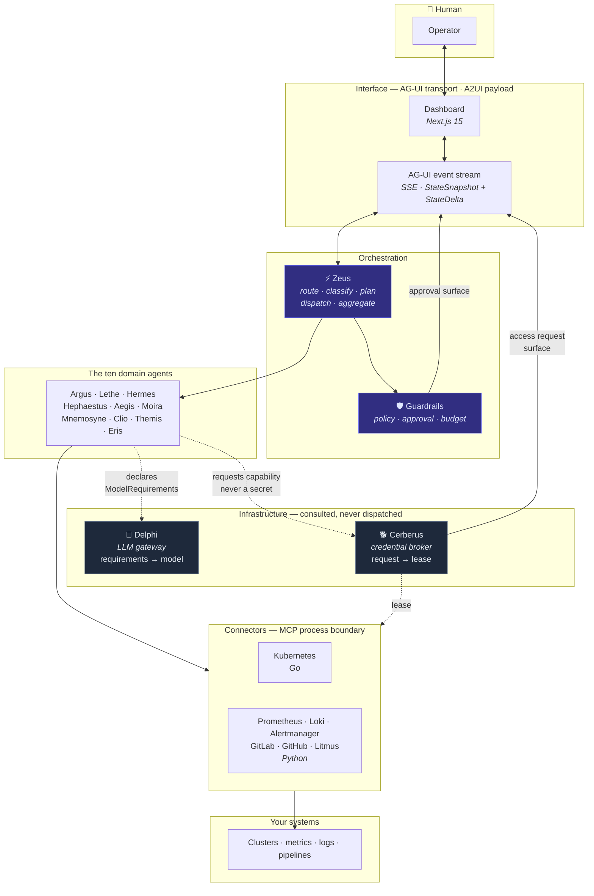

# Pantheon

[](LICENSE)
[](ROADMAP.md)
[](pyproject.toml)
[](go.work)
[](dashboard/package.json)

A polyglot, multi-agent AIOps platform. Eleven specialists under one
orchestrator, investigating incidents, delivery health and capacity — with every
write action gated, every credential brokered, and every run auditable.

---

## ⚠️ Status: Phase 0 — this is a scaffold, not a working product

**No investigation has ever run.** Agents, orchestration and connectors are
documented stubs carrying `# TODO: Phase N` markers. If you clone this expecting
software that triages an incident, you will be disappointed within a minute, so
here is the honest split:

| What genuinely exists and works | What does not exist yet |
|---|---|
| **Contracts** — 49 Pydantic v2 models, the single source of truth | Agent implementations (all eleven) |
| **Codegen** — Pydantic → JSON Schema → Go + TypeScript, with drift detection | The orchestrator (Zeus) |
| **281 tests** — structural, security and type-level guards among them, each guard verified against a planted violation | Connectors (all seven) |
| **Deploy skeleton** — Helm lints and templates, Terraform validates, Compose runs | Delphi and Cerberus behaviour (structure and contracts only) |
| **CI** — 9 workflows, SHA-pinned, one required check | The AG-UI endpoint and A2UI surfaces |
| **Dashboard** — builds, with the AG-UI client and A2UI renderer | Anything that produces a Finding |
| **Six ADRs** recording the decisions and what was rejected | |

The interesting part right now is the **guards**, not the features. The
scaffolding enforces its own rules: the allowlist cannot drift from the
contract, agents cannot import the modules that hold plaintext, generated code
cannot be hand-edited, and the repository map cannot gain or lose a top-level
entry without a test failing. See
[docs/guard-verification.md](docs/guard-verification.md) — including the guards
that turned out not to work, and how each was discovered.

[ROADMAP.md](ROADMAP.md) has the phase plan.

---

## The eleven agents

| Codename | Domain | Role | Phase |
|---|---|---|---|
| **Zeus** | `core/orchestrator/` | Routes, classifies, plans, dispatches, aggregates | 2 |
| **Argus** | `agents/anomaly/` | Detects metric anomalies, correlates them into findings | 1 |
| **Lethe** | `agents/log_clustering/` | Clusters high-volume logs, surfaces novelty | 2 |
| **Hermes** | `agents/nl_query/` | Turns natural language into connector queries, and back | 2 |
| **Hephaestus** | `agents/ci_triage/` | Triages failing CI, separates flake from real regression | 4 |
| **Aegis** | `agents/manifest_review/` | Reviews manifests and IaC diffs for risk before rollout | 3 |
| **Moira** | `agents/capacity/` | Forecasts capacity, predicts saturation | 5 |
| **Mnemosyne** | `agents/knowledge/` | Recalls prior incidents, runbooks, tribal knowledge | 5 |
| **Clio** | `agents/reporting/` | Writes timelines, postmortems, executive summaries | 5 |
| **Themis** | `agents/dora/` | Computes DORA metrics, judges delivery health | 4 |
| **Eris** | `agents/chaos/` | Designs and supervises chaos experiments | 5 |

**Delphi** and **Cerberus** are deliberately *not* on that list. They are
infrastructure agents consult, not specialists Zeus dispatches to — no roster
entry, no manifest.

## Architecture



Three rules hold that diagram together:

1. **Agents never name a model.** They declare requirements; Delphi resolves.
   Swapping providers is a settings change, not an eleven-file edit.
   ([ADR 0004](docs/adr/0004-llm-provider-abstraction.md))
2. **Agents never hold credentials.** They request a capability; Cerberus mints a
   lease bound to one connector and one investigation; the connector redeems it.
   A secret in an agent's context would enter a prompt — an unauditable,
   unrevocable exfiltration path.
   ([ADR 0005](docs/adr/0005-credential-brokering.md))
3. **Agent-generated UI is untrusted data, not code.** Rendered from a closed
   allowlist; no HTML, no script, no agent-supplied URLs.
   ([ADR 0006](docs/adr/0006-agentic-ui-protocols.md))

[ARCHITECTURE.md](ARCHITECTURE.md) has the layer model and the three flows.

## Languages

| Language | Owns | Why |
|---|---|---|
| **Python 3.12** | `core/`, `agents/`, `api/`, `simulator/`, most connectors | The agent and LLM ecosystem. Pydantic v2 defines every shape once. |
| **Go 1.23** | `pkg/`, `connectors/kubernetes/`, `cmd/` | `client-go` is the only first-class Kubernetes client; single static binaries for a CLI and a sidecar. |
| **TypeScript** | `dashboard/` — and nowhere else | Next.js 15 App Router. |

`core/contracts/` is the source of truth. Go structs and TypeScript types are
**generated** from it — hand-writing a mirrored type in either is forbidden, and
a test enforces it.

## Quickstart

Needs Python 3.12 + [uv](https://docs.astral.sh/uv/), Go 1.23, Node 22+ with
pnpm, Docker, and — for the deploy checks — Helm and Terraform.

```bash
git clone https://github.com/simootaz/pantheon-aiops.git
cd pantheon-aiops

make install          # uv sync, git hooks, dashboard deps

make lint typecheck test        # Python: ruff, mypy --strict, pytest
make lint-go test-go            # Go: vet, golangci-lint, build, test
make lint-ts test-ts            # TypeScript: biome, tsc, vitest
make codegen-verify             # fail if generated output has drifted
```

Bring up the datastores, object storage and a local model runtime — **no API
keys required**:

```bash
make up PROFILE=llm-local
#   API            http://localhost:8000
#   MinIO console  http://localhost:9001
```

`make help` lists every target.

> `pnpm` is installed globally via npm rather than corepack, and its version is
> pinned once as `packageManager` in `dashboard/package.json` — CI reads it from
> there, so local and CI cannot drift.

## Documentation

| | |
|---|---|
| [docs/REPOSITORY_MAP.md](docs/REPOSITORY_MAP.md) | **Read first.** Every directory, where things go, and the structure changelog |
| [ARCHITECTURE.md](ARCHITECTURE.md) | Layers, the three flows, the contract pipeline |
| [ROADMAP.md](ROADMAP.md) | Phases 0–7 and every deferred decision |
| [CONTRIBUTING.md](CONTRIBUTING.md) | Git Flow, codegen rules, guard philosophy |
| [docs/adr/](docs/adr/README.md) | Six decision records |
| [docs/guard-verification.md](docs/guard-verification.md) | How every guard was verified, and the ones that failed |

## Licence

[Apache 2.0](LICENSE).
