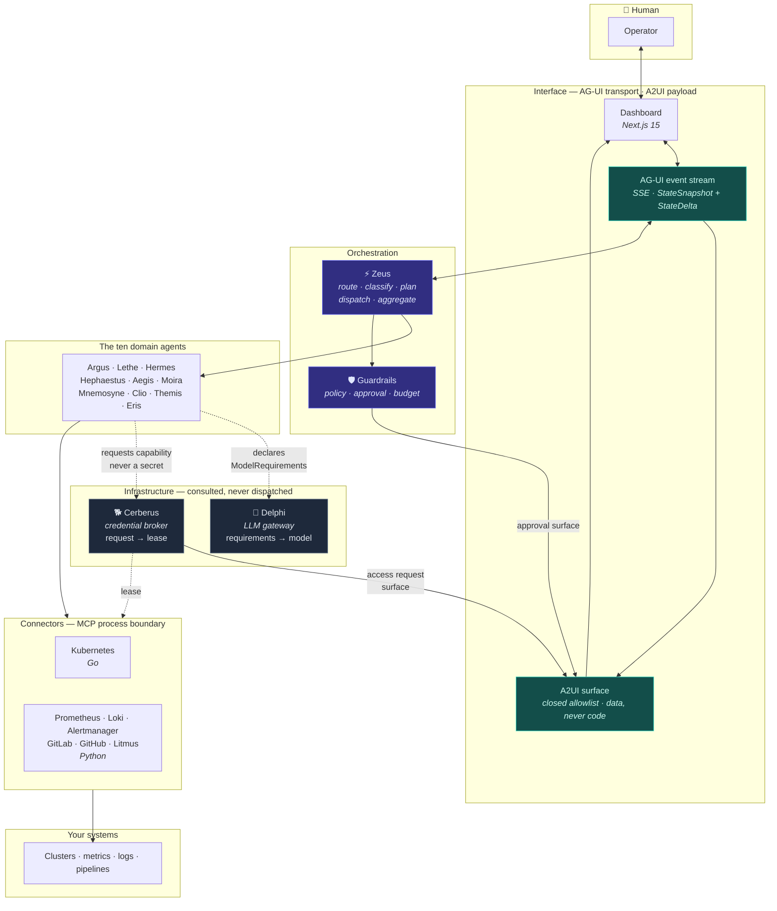

# Pantheon

[](https://github.com/simootaz/pantheon-aiops/actions/workflows/ci.yml)
[](LICENSE)
[](ROADMAP.md)
[](pyproject.toml)
[](go.work)
[](dashboard/package.json)

A polyglot, multi-agent AIOps platform. Eleven specialists under one
orchestrator, investigating incidents, delivery health and capacity — with every
write action gated, every credential brokered, and every run auditable.

---

## Status: Phase 1, in progress

**No investigation has run end to end.** Zeus does not dispatch, no agent
produces a Finding, and every domain agent is a stub carrying a `# TODO: Phase N`
marker. What exists is the substrate those agents will stand on, and a simulator
that produces the data they will read.

Here is the honest split.

### Runs today

| | |
|---|---|
| **Simulator** | Five YAML scenarios generating real metrics, logs and pipeline events into Prometheus, Loki and a pushgateway. `make sim` and you can watch a fault develop. |
| **Contracts** — 49 Pydantic v2 models | The single source of truth. Go structs and TypeScript types are generated from them, and drift fails the build. |
| **Connectors** | Prometheus and Alertmanager speak MCP, read-only, with the tool allowlist enforced at bind **and** at call. |
| **Agent runtime** | `agents/_base/` gives a subclass one required coroutine; the manifest registry loads and validates all ten. Finding ids are deterministic, so a retry cannot duplicate a claim. |
| **Alertmanager receiver** | `POST /webhooks/alertmanager` stores the payload verbatim and publishes a `TriggerReceivedEvent`. |
| **339 tests** | Structural, security and type-level guards among them, each guard verified against a planted violation in both directions. |
| **CI** — 9 workflows | SHA-pinned, one required check, green on `develop`. |
| **Deploy skeleton** | Helm lints and templates, Terraform validates, Compose brings the stack up. |
| **Seven ADRs** | The decisions, and what was rejected. |

### Does not exist yet

| | |
|---|---|
| **Zeus** | The orchestrator. Routing, classification, planning, dispatch and aggregation are Phase 2. |
| **Every domain agent** | Argus first, at Phase 1. The other nine follow. |
| **Delphi** | The LLM gateway is designed ([ADR 0004](docs/adr/0004-llm-provider-abstraction.md)) and unbuilt. |
| **Cerberus behaviour** | Contracts and redaction exist; brokering, leases and revocation do not. |
| **The remaining connectors** | Kubernetes, Loki, GitLab, GitHub and Litmus. |
| **The AG-UI endpoint** | The dashboard renders A2UI surfaces; nothing streams into them yet. |

The interesting part right now is the **guards** and the **simulator**, not the
features. [ROADMAP.md](ROADMAP.md) has the phase plan and every deferred
decision.

---

## The eleven agents

| Codename | Domain | Role | Phase |
|---|---|---|---|
| **Zeus** | `core/orchestrator/` | Routes, classifies, plans, dispatches, aggregates | 2 |
| **Argus** | `agents/anomaly/` | Detects metric anomalies, correlates them into findings | 1 |
| **Lethe** | `agents/log_clustering/` | Clusters high-volume logs, surfaces novelty | 2 |
| **Hermes** | `agents/nl_query/` | Turns natural language into connector queries, and back | 2 |
| **Hephaestus** | `agents/ci_triage/` | Triages failing CI, separates flake from real regression | 4 |
| **Aegis** | `agents/manifest_review/` | Reviews manifests and IaC diffs for risk before rollout | 3 |
| **Moira** | `agents/capacity/` | Forecasts capacity, predicts saturation | 5 |
| **Mnemosyne** | `agents/knowledge/` | Recalls prior incidents, runbooks, tribal knowledge | 5 |
| **Clio** | `agents/reporting/` | Writes timelines, postmortems, executive summaries | 5 |
| **Themis** | `agents/dora/` | Computes DORA metrics, judges delivery health | 4 |
| **Eris** | `agents/chaos/` | Designs and supervises chaos experiments | 5 |

Zeus dispatches to the ten domain agents. **Delphi** and **Cerberus** sit beside
them as infrastructure — consulted, never dispatched to, with no roster entry
and no manifest:

| | | |
|---|---|---|
| **Delphi** | `core/delphi/` | An agent declares what a task *needs*; Delphi resolves that to a model. No agent names one. |
| **Cerberus** | `core/cerberus/` | An agent requests a *capability*; Cerberus mints a lease bound to one connector and one investigation. No agent holds a secret. |

`tests/unit/test_repo_structure.py::test_agent_roster_matches_repository_map`
asserts `agents/` holds exactly these ten domains and nothing else.

## Architecture



**AG-UI is the transport; A2UI is the payload.** AG-UI carries the event stream
between orchestrator and browser. A2UI describes what to render, as a closed
allowlist of component types generated from the same contracts as everything
else — so an agent proposes a surface, and the dashboard renders only shapes it
already knew about. No HTML, no script, no agent-supplied URLs.

Three rules hold the diagram together:

1. **Agents never name a model.** They declare requirements; Delphi resolves.
   Swapping providers is a settings change, not an eleven-file edit.
   ([ADR 0004](docs/adr/0004-llm-provider-abstraction.md))
2. **Agents never hold credentials.** They request a capability; Cerberus mints a
   lease bound to one connector and one investigation; the connector redeems it.
   A secret in an agent's context would enter a prompt — an unauditable,
   unrevocable exfiltration path.
   ([ADR 0005](docs/adr/0005-credential-brokering.md))
3. **Agent-generated UI is untrusted data, not code.**
   ([ADR 0006](docs/adr/0006-agentic-ui-protocols.md))

[ARCHITECTURE.md](ARCHITECTURE.md) has the layer model and the three flows.

---

## How this repository is built

This is the part worth reading even if the domain does not interest you.

### If you have not seen it red, you have not tested it

Every guard is verified by **planting a violation and watching it fail**, then
reverting and watching it pass. A guard observed only passing is unverified: it
might be passing because the invariant holds, or because it cannot detect a
breach, and those look identical from outside.

[docs/guard-verification.md](docs/guard-verification.md) records each one,
including the guards that turned out not to work. Three examples, because the
concrete failures argue better than the principle:

**A threshold that reads as enforced, and is not the one enforced.** `trivy
config` failed CI reporting *"found CRITICAL or HIGH misconfigurations"*. It had
found 37: twenty-eight LOW, nine MEDIUM, zero HIGH. The step declared
`severity: CRITICAL,HIGH` beside `exit-code: 1` — but `severity` does not filter
SARIF output, so the job failed on **any** finding while every visible signal
named a threshold that was not being applied. The sibling `trivy fs` job had the
identical defect and passed, for want of anything to trip over.

**A claim repeated is not a claim verified.** Three files stated that CI read the
pinned `pnpm` version from `dashboard/package.json`. It does not — the action
reads the *repository root*, and there is no root `package.json`, so every
dashboard job failed. `git log -S` shows the asserting guard never existed.
Repetition had made it feel established.

**A scanner that aborts reports fewer findings.** A Dockerfile containing only
comments made trivy exit 1 with a parse error — indistinguishable, from outside,
from exiting 1 because it found something. Deleting the file let the scan
complete, whereupon it reported five HIGH misconfigurations the abort had been
hiding. Absence of findings and absence of scanning look the same in a red tick.

### Measured, not chosen

Numbers that matter are derived from the thing they describe, not chosen. The
simulator's default compression is held under `simulator.runner.max_honest_speed`
— what the machine can actually deliver at the configured tick — by
`tests/unit/test_makefile.py::test_the_default_sim_speed_is_one_the_runner_can_deliver`,
so the two cannot drift and the honest "fell behind" warning stays meaningful
instead of firing on every ordinary run.

A number chosen by feel is a number nobody can defend when it misfires.

### Empirical gates over structural ones

A test that the YAML parses proves the YAML parses. The gates that matter run
the thing: `make test-sim` asserts on data a live Prometheus actually returned,
and fails rather than skips when the stack is missing, because a skipped gate
reads as a pass.

### Claims name their tests

Every "X is guarded" sentence in this repository names the test that enforces
it, or is written as intent rather than fact. An audit of 126 mechanism claims
found eight describing mechanisms that did not exist; every false one was in the
set that named no test.

Counts in this file are derived from the repository and compared by
`tests/unit/test_repo_structure.py::test_every_typed_count_in_the_docs_is_true`,
after they sat stale for weeks. [CONTRIBUTING.md](CONTRIBUTING.md) has the full
working agreement.

---

## Languages

| Language | Owns | Why |
|---|---|---|
| **Python 3.12** | `core/`, `agents/`, `api/`, `simulator/`, most connectors | The agent and LLM ecosystem. Pydantic v2 defines every shape once. |
| **Go 1.25** | `pkg/`, `connectors/kubernetes/`, `cmd/` — 5 modules | `client-go` is the only first-class Kubernetes client; single static binaries for a CLI and a sidecar. |
| **TypeScript** | `dashboard/` — and nowhere else | Next.js 15 App Router. |

`core/contracts/` is the source of truth. Go structs and TypeScript types are
**generated** from it; hand-writing a mirrored type in either is forbidden, and
`make codegen-verify` regenerates into a temp directory and diffs, in
pre-commit and in CI.

## Quickstart

Needs Python 3.12 + [uv](https://docs.astral.sh/uv/), Go 1.25, Node 22+ with
pnpm, and Docker. Helm and Terraform only for the deploy checks.

```bash
git clone https://github.com/simootaz/pantheon-aiops.git
cd pantheon-aiops

make install          # uv sync, git hooks, dashboard deps
```

Bring up the datastores, observability stack and a local model runtime — **no
API keys required**:

```bash
make up PROFILE=llm-local
#   API             http://localhost:8000
#   Prometheus      http://localhost:9090
#   Alertmanager    http://localhost:9093
#   MinIO console   http://localhost:9001
```

Then run a scenario and watch a fault develop:

```bash
make sim SCENARIO=bad_deploy_5xx
```

A simulated day is compressed into minutes, so you get a real diurnal baseline
before the fault lands. While it runs:

- **Prometheus** — `sum(rate(pantheon_http_requests_errors_total[1m]))` climbs
  for the `checkout` service while every other service stays flat.
- **The container logs** — the runner narrates each phase as it starts and ends,
  and warns if the machine could not hold the requested compression.
- **Loki** — error-level lines appear from the affected pods only.

Five scenarios ship: `bad_deploy_5xx`, `memory_leak`, `noisy_neighbor`,
`disk_pressure`, `flaky_test_storm`. Each carries its own expected root cause,
which is what agent output will eventually be scored against.

Verify everything the way CI does:

```bash
make lint typecheck test         # Python: ruff, mypy --strict, pytest
make lint-go test-go             # Go: vet, golangci-lint, build, test
make lint-ts test-ts             # TypeScript: biome, tsc, vitest
make codegen-verify              # fail if generated output has drifted
make test-sim                    # assert on data a live stack returned
```

`make help` lists every target.

## Documentation

| | |
|---|---|
| [docs/REPOSITORY_MAP.md](docs/REPOSITORY_MAP.md) | **Read first.** Every directory, where things go, and the structure changelog |
| [ARCHITECTURE.md](ARCHITECTURE.md) | Layers, the three flows, the contract pipeline |
| [ROADMAP.md](ROADMAP.md) | Phases 0–7 and every deferred decision |
| [CONTRIBUTING.md](CONTRIBUTING.md) | Git Flow, codegen rules, guard philosophy |
| [docs/adr/](docs/adr/README.md) | Seven decision records |
| [docs/guard-verification.md](docs/guard-verification.md) | How every guard was verified, and the ones that failed |

## Licence

[Apache 2.0](LICENSE).
