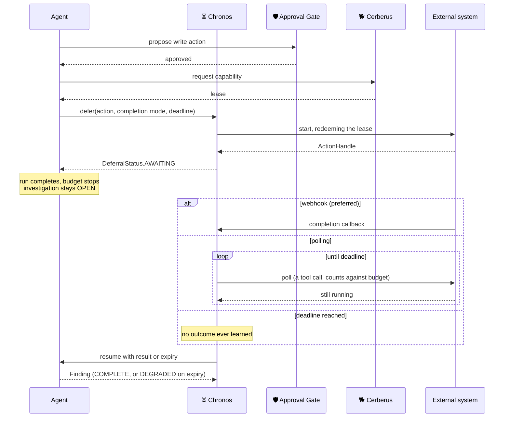

# ADR 0007 — Chronos: deferred actions for operations that outlive a run

- **Status:** Proposed
- **Date:** 2026-08-20
- **Decided on branch:** backlog — not implemented
- **Implementation:** Phase 3 at the earliest. Depends on the Approval Gate and on Temporal being load-bearing.

> The flow diagram in this ADR was **drawn from a written description**, not
> supplied. Treat it as a reconstruction to be corrected, not as the specified
> design.

## Context

`AgentBudget.max_seconds` is 120, and every manifest carries one. That number is
sized for an agent that queries connectors, reasons, and produces Findings.

Real operations do not fit in it:

| Operation | Realistic duration |
|---|---|
| A CI pipeline triggered for a bisect | 5–40 minutes |
| A chaos experiment with a steady-state check | 30–90 minutes |
| A rolling restart, watched to completion | 5–20 minutes |
| A backup or restore verification | Tens of minutes |

An agent that starts one has two options today, and both are bad.

**Block and die.** Await the operation inside `investigate()`. The budget expires
at 120 seconds, the run is killed, and the operation continues without anyone
watching it. The investigation records a timeout, not an outcome.

**Fire and forget.** Start the operation, return immediately, never learn what
happened. The Finding says "triggered a rebuild" and nothing else. The next run
has no way to connect a result to the request that caused it, because nothing
recorded that a request was outstanding.

Neither produces the thing an investigation needs: **the outcome of the
operation, attached to the reason it was started.**

## Decision

**Chronos owns deferred actions.** It is infrastructure, beside Delphi and
Cerberus — consulted, never dispatched to, no roster entry and no manifest. Zeus
does not plan a step for it; agents ask it to hold something.

### Waiting is not work

The central principle, and the one every other decision here follows from.

An agent that starts a long operation **completes its run immediately**. It
returns a Finding describing what it started, the investigation stays open, and
the agent process ends. When the operation finishes, the agent is resumed with
the result.

Wall-clock waiting **must not** count against `max_seconds`. Only active work
does — reasoning, tool calls, assembling a Finding.

The alternative was considered and rejected: letting a run stay alive across the
wait, with the budget paused. It fails for a reason worth stating, because it
sounds workable. A budget that excludes wall-clock time still has to be enforced
against *something*, and a held-open run consumes a worker slot, a connection,
and a lease for the entire duration. The budget would say 120 seconds while the
run occupied an hour of capacity. **A limit that does not bound what it is
protecting is not a limit.**

Counting the wait would be worse. `max_seconds: 120` would mean "this agent may
be used for anything that finishes inside two minutes", so every budget becomes
a bet on someone else's CI speed — and the same agent would succeed or fail
depending on how busy an unrelated build queue was that afternoon.

### The flow

### Temporal is the mechanism

Durable timers and signals that survive worker restarts. A deferred action is a
workflow: the timer is the deadline, the signal is the completion.

This is the **first feature that genuinely requires** what Phase 0 chose. Until
now Temporal has been carrying retries and scheduling that a simpler queue could
have carried. An hour-long wait that survives a deploy is not something a queue
does.

### Completion, in preference order

1. **Webhook.** The external system calls us. The receiver pattern already
   exists — `api/routers/alerts.py` takes Alertmanager notifications, stores the
   payload verbatim and publishes an event. A completion callback is the same
   shape with a different payload.
2. **Polling with backoff.** Only where the system cannot call back. **Each poll
   is a tool call and counts against the agent's budget**, which makes the
   schedule *derived* rather than picked: `max_tool_calls` and the deadline
   together determine how often you may poll. A polling interval chosen by feel
   is a number nobody can defend, and this repository has enough of those.
3. **Deadline — mandatory, on every deferral.** Not a fallback for the other two;
   an independent requirement. A webhook that never arrives and a poll loop
   against a system that never answers are the same failure.

On expiry, Chronos resumes the agent to produce a **DEGRADED Finding** that says
what was started and that the outcome was never learned. Explicitly *not* an
error and *not* silence:

> An investigation that waits forever is worse than one that fails. A failure is
> read; a wait is assumed to be progress.

### Contracts

`core/contracts/deferred.py`, through codegen to Go and TypeScript like
everything else:

| Type | Carries |
|---|---|
| `DeferredAction` | what was started, by which agent, for which investigation, when, under whose approval and lease |
| `ActionHandle` | the external system's identifier — the thing a webhook or poll correlates against |
| `CompletionMode` | `WEBHOOK` / `POLL` / `DEADLINE_ONLY`, closed enum |
| `DeferralStatus` | `AWAITING` / `COMPLETED` / `EXPIRED` / `CANCELLED`, closed enum |

Plus `StepStatus.AWAITING_EXTERNAL`, so a plan step that is waiting is
distinguishable from one that is running. `Verdict` already derives `partial`
from step status; a step that never resolves must not read as complete.

Enums, not strings — for the reason ADR 0006's allowlist gives and
`BaselineEstimator` repeats: a free-text status field is where `awaiting`,
`AWAITING` and `waiting` all appear within a month.

## The open decision: budget on resumption

**A resumed agent receives the remainder of its original budget, not a fresh
one.**

This is related to the retry decision but is not the same question, and the
difference is the reason for the answer.

**A retry repeats work.** The previous attempt produced nothing usable, so the
new attempt starts from the same place and needs the same allowance. A fresh
budget per attempt is correct there.

**A resumption continues work.** The pre-deferral half already happened — it
queried connectors, reasoned, decided to act. Handing a fresh budget on
resumption makes the total unbounded: an agent that defers twice gets three full
budgets, and `max_tool_calls: 20` becomes 60 for anyone who structures their
work around a deferral. The limit would be trivially avoidable by the agents
most likely to need limiting.

So the budget is carried on the `DeferredAction` and restored on resumption,
minus what was spent. The wait itself costs nothing, per the principle above.

The cost is real and worth stating: **an agent that spends 110 of 120 seconds
before deferring gets 10 seconds to interpret the result.** That is a genuinely
awkward outcome, and the mitigation is not a bigger budget — it is that
interpreting a webhook payload is cheap, while the expensive half is the
investigation that preceded it. If that turns out to be wrong in practice, the
fix is a *stated* resumption allowance sized by measurement, not a fresh budget
by default.

## Cross-references

- **Approval Gate approves before starting.** A deferred action is almost always
  a write. The approval belongs to the moment of *starting*, not resumption —
  by the time a result arrives, the write has already happened.
- **Cerberus lease expiry during a long wait stops being hypothetical.** ADR 0005
  already specifies the behaviour: expiry re-prompts, revocation produces a bare
  Finding. Chronos is where a lease routinely outlives the run that minted it,
  and it is bound to one connector and one investigation for exactly this reason.
- **AG-UI must distinguish waiting from stalled.** The dashboard needs which
  agent, what it started, when it is due, and how long it has waited. An
  investigation showing no activity for forty minutes is either healthy or dead,
  and the operator cannot tell without that.
- **Arachne and Gaia both depend on this shape.** Neither is specified yet;
  both are long-running by nature, and building either before Chronos means
  building a private version of it.

## Consequences

- Temporal becomes load-bearing rather than convenient. A worker deploy must not
  drop timers, which raises the bar on how workers are rolled.
- An open investigation is no longer evidence of activity. Anything that reasons
  about staleness must consult `DeferralStatus` first.
- The webhook receiver becomes a correlation surface: a completion callback has
  to find its `ActionHandle`, and an unmatched callback must be stored rather
  than dropped, the same way the Alertmanager payload is.
- Deadlines must be sized against reality. A deadline shorter than the operation
  guarantees a DEGRADED Finding every time — the same failure class as an alert
  rule whose `for:` outlives its fault.

## Rejected

| Option | Why not |
|---|---|
| Block inside `investigate()` and raise `max_seconds` | Makes the budget meaningless. The ceiling would have to exceed the slowest external system, so it would bound nothing. |
| Fire and forget, correlate later by log scraping | The outcome is never attached to the reason. Findings become claims nobody can trace. |
| A polling loop in the agent, sleeping between polls | Consumes a worker for the duration and dies on restart. This is the problem, not a solution. |
| A cron that sweeps for finished operations | Nothing records what is outstanding, so the sweep has no work list. That is the state today. |
